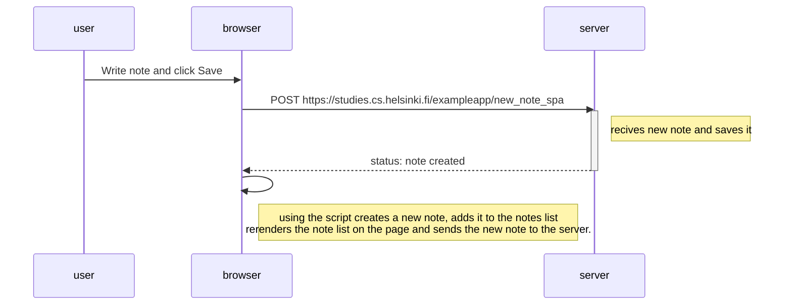

```mermaid

    sequenceDiagram
    participant user
    participant browser
    participant server
    

    user->>browser: Write note and click Save

    browser->>server: POST https://studies.cs.helsinki.fi/exampleapp/new_note_spa

    activate server
    Note right of server: recives new note and saves it
    server-->>browser: status: note created
    deactivate server

    browser->>browser: 
    Note right of browser: using the script creates a new note, adds it to  the notes list<br>rerenders the note list on the page and sends the new note to the server.

    

    

    


    

```